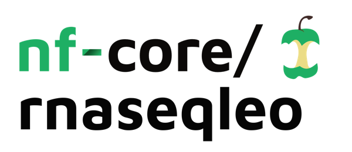

<h1>
  <picture>
    <source media="(prefers-color-scheme: dark)" srcset="docs/images/nf-core-rnaseqleo_logo_dark.png">
    
  </picture>
</h1>

[](https://github.com/nf-core/rnaseqleo/actions/workflows/nf-test.yml)
[](https://github.com/nf-core/rnaseqleo/actions/workflows/linting.yml)[](https://nf-co.re/rnaseqleo/results)[](https://doi.org/10.5281/zenodo.XXXXXXX)
[](https://www.nf-test.com)

[](https://www.nextflow.io/)
[](https://github.com/nf-core/tools/releases/tag/3.3.2)
[](https://docs.conda.io/en/latest/)
[](https://www.docker.com/)
[](https://sylabs.io/docs/)
[](https://cloud.seqera.io/launch?pipeline=https://github.com/nf-core/rnaseqleo)

[](https://nfcore.slack.com/channels/rnaseqleo)[](https://bsky.app/profile/nf-co.re)[](https://mstdn.science/@nf_core)[](https://www.youtube.com/c/nf-core)

# nf-core/rnaseqleo

### Automated RNA-Seq Processing and Quantification Workflow

---

## Overview

`nf-core/rnaseqleo` is a modular and reproducible **Nextflow DSL2** workflow for RNA sequencing (RNA-seq) data analysis.  
It integrates established bioinformatics tools including **FastQC**, **TrimGalore**, **Salmon**, and **MultiQC** to automate key steps of RNA-seq data processing — from quality control and trimming to transcript quantification and reporting.

This workflow was developed as part of a **Master’s course in Bioinformatics**, focusing on **reproducibility**, **FAIR principles**, and **nf-core workflow design**.

---

## Features

- Supports both **local FASTQ inputs** and **SRA accessions** (via `nf-core/fetchngs`).
- Performs automated:
  - Quality control (`FastQC`)
  - Adapter trimming (`TrimGalore`)
  - Transcript quantification (`Salmon`)
  - Report summarization (`MultiQC`)
- Builds or uses precomputed **Salmon transcript indices**
- Produces a combined **gene expression matrix (`salmon_counts_matrix.tsv`)**
- Fully **containerized** for reproducibility (Docker / Singularity)
- Modularized to align with **nf-core DSL2** standards

---

## Pipeline Workflow

1. **Input acquisition**  
   - Either provide a local `samplesheet.csv`  
   - Or list SRA accessions (`--sra_ids`) to fetch FASTQ files automatically via `nf-core/fetchngs`.

2. **Quality control**  
   - Performed using **FastQC**, summarized by **MultiQC**.

3. **Trimming**  
   - **TrimGalore** removes adapters and low-quality bases.

4. **Quantification**  
   - **Salmon** performs quasi-mapping-based transcript quantification.

5. **Report generation**  
   - **MultiQC** produces a final HTML report combining all results.
   - A merged **gene count matrix** is produced for downstream analysis.

---

## Pipeline Structure

```
.
├── main.nf                     # Main entry point
├── workflows/
│   └── rnaseqleo.nf            # Core workflow logic
├── subworkflows/
│   └── local/                  # Custom local modules
├── modules/
│   └── nf-core/                # nf-core standard modules
├── conf/
│   └── genomes.config          # Genome configurations
├── assets/
│   └── multiqc_config.yml      # MultiQC templates
└── README.md                   # This file
```

---

## Installation

### Requirements
- **Nextflow ≥ v23.10**
- **Docker** or **Singularity**
- (Optional) **Git** for version control

### Clone the Repository
```bash
git clone https://github.com/yourusername/nf-core-rnaseqleo.git
cd nf-core-rnaseqleo
```

### Test Run
You can test the workflow with example data:
```bash
nextflow run main.nf -profile docker,test
```

---

## Usage

### Example 1 – Using local FASTQ files
```bash
nextflow run main.nf     --input samplesheet.csv     --genome GRCh38     --outdir results/     -profile docker
```

### Example 2 – Using SRA IDs
```bash
nextflow run main.nf     --sra_ids SRR1234567,SRR1234568     --genome GRCh38     --outdir results/     -profile docker
```

### Parameters
| Parameter | Description |
|------------|-------------|
| `--input` | Path to a local samplesheet CSV |
| `--sra_ids` | Comma-separated list of SRA run accessions |
| `--genome` | Genome key as defined in `genomes.config` |
| `--outdir` | Output directory for results |
| `--subsample` | Optional: limit reads for test runs |

---

## Output Structure

```
results/
 ├── fetchngs/                   # Fetched FASTQ files (if using SRA)
 ├── fastqc/                     # Quality control reports
 ├── trim_galore/                # Trimmed reads
 ├── salmon/                     # Quantification results
 ├── expression/                 # Combined expression matrix
 │   └── salmon_counts_matrix.tsv
 ├── multiqc_report.html         # Aggregated QC report
 └── pipeline_info/              # Versions and logs
```

---

## Example Outputs

| Output | Description |
|--------|--------------|
| `multiqc_report.html` | Combined summary of QC metrics |
| `salmon_counts_matrix.tsv` | Transcript counts per sample |
| `*_quant.sf` | Individual Salmon quantification files |

---

## Reproducibility and FAIR Principles

This workflow adheres to the **FAIR** and **reproducibility** principles through:

- **Version control:** All code hosted on GitHub with tagged releases.  
- **Containerization:** Docker and Singularity ensure consistent environments.  
- **Metadata tracking:** Tool versions saved as YAML in `pipeline_info/`.  
- **Transparency:** All parameters and configuration schemas are public.  
- **Accessibility:** Open-source license for reuse and modification.

To ensure reproducibility, every run is logged, including:
- Container image digests
- Software versions
- Parameter schema
- System environment

---

## Citation

- Di Tommaso *et al.* (2017) *Nextflow enables reproducible computational workflows.* *Nature Biotechnology.*
- Ewels *et al.* (2020) *The nf-core framework for community-curated bioinformatics pipelines.* *Nature Biotechnology.*

---

## Author and Acknowledgements

**Author:** 
Leo Krappen

**Acknowledgements:**  
I would like to thank the instructors of the Bioinformatics Workflow course, as well as the nf-core community for providing documentation and open-source modules that served as the foundation for this project.

---

## License

This project is released under the **MIT License**.  
You are free to use, modify, and distribute it with proper attribution.

---

## References

- Di Tommaso, P. *et al.* (2017). *Nextflow enables reproducible computational workflows.* Nature Biotechnology, 35(4):316–319.  
- Ewels, P. *et al.* (2020). *The nf-core framework for community-curated bioinformatics pipelines.* Nature Biotechnology, 38:276–278.  
- Patro, R. *et al.* (2017). *Salmon provides fast and bias-aware quantification of transcript expression.* Nature Methods, 14(4):417–419.  
- Wang, Z., Gerstein, M., Snyder, M. (2009). *RNA-Seq: a revolutionary tool for transcriptomics.* Nature Reviews Genetics, 10(1):57–63.  
- Andrews, S. (2010). *FastQC: a quality control tool for high throughput sequence data.* Babraham Bioinformatics, Babraham Institute. [http://www.bioinformatics.babraham.ac.uk/projects/fastqc/](http://www.bioinformatics.babraham.ac.uk/projects/fastqc/)  
- Krueger, F. (2015). *Trim Galore: A wrapper tool around Cutadapt and FastQC to consistently apply quality and adapter trimming to FastQ files.* Babraham Bioinformatics, Babraham Institute. [http://www.bioinformatics.babraham.ac.uk/projects/trim_galore/](http://www.bioinformatics.babraham.ac.uk/projects/trim_galore/)  
- Patro, R., Duggal, G., Love, M. I., Irizarry, R. A., & Kingsford, C. (2017). *Salmon provides fast and bias-aware quantification of transcript expression.* **Nature Methods**, 14(4), 417–419.  
- Ewels, P., Magnusson, M., Lundin, S., & Käller, M. (2016). *MultiQC: summarize analysis results for multiple tools and samples in a single report.* **Bioinformatics**, 32(19), 3047–3048.  
- Kim, D., Paggi, J. M., Park, C., Bennett, C., & Salzberg, S. L. (2019). *HISAT2 and HISAT-genotype: graph-based alignment of next-generation sequencing reads to a population of genomes.* **Nature Biotechnology**, 37, 907–915.  
- Li, H., Handsaker, B., Wysoker, A., Fennell, T., Ruan, J., Homer, N., Marth, G., Abecasis, G., & Durbin, R. (2009). *The Sequence Alignment/Map format and SAMtools.* **Bioinformatics**, 25(16), 2078–2079.  
- Liao, Y., Smyth, G. K., & Shi, W. (2014).

---

> **The nf-core framework for community-curated bioinformatics pipelines.**
>
> Philip Ewels, Alexander Peltzer, Sven Fillinger, Harshil Patel, Johannes Alneberg, Andreas Wilm, Maxime Ulysse Garcia, Paolo Di Tommaso & Sven Nahnsen.
>
> _Nat Biotechnol._ 2020 Feb 13. doi: [10.1038/s41587-020-0439-x](https://dx.doi.org/10.1038/s41587-020-0439-x).
